# 一、背景

受到 [alfred-mweb-workflow 这个项目](https://github.com/tianhao/alfred-mweb-workflow)的启发，
使用新的语言改写了内部实现，大幅提升了搜索的性能。

# 二、 使用说明
[下载](https://github.com/chenzz/mweb-alfred-assistant/raw/master/MWeb小助手.alfredworkflow)

## 1. 搜索&打开内部文档

使用方法:
用户可以使用关键字 "mo" 或者自定义快捷键触发 workflow

```
mo [keyword1]
hotkey-> [keyword1]
```

示例

```BASH
# 不输入任何参数，按最近修改时间排序文档
mo 
# 查找有 alfred 关键字的文档
mo alfred
```

**功能说明**：

1. 如果不输入关键字，会列出最近修改过的7个文档，按照最近修改时间倒序排序；
2. 输入关键字，搜索标题中包含关键字的文件；

不带关键字，列出前7个最近改过的文档

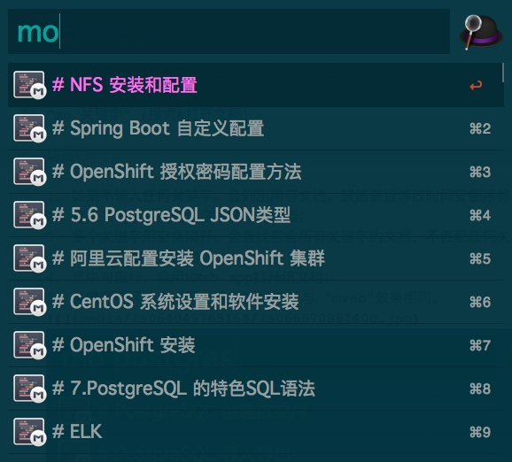

一个关键字

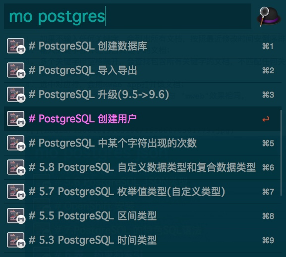

## 2. "mpush" (提交生成的静态博客到远端Git(Hub)
我用的是GitHub做静态博客，在用MWeb生成网站之后，需要做 `git add ...;  git commit ;git push`等一序列操作才能把最新文章推送到GitHub，博客才更新，所以做了一个一键push功能

使用方法：
1. 按设置环境变量的方法设置 MBLOG_HOME 变量 MBLOG_URL变量(一次性)
2. 用MWeb生成生成网站
3. 使用mpush 一键推送到GitHub或者别的远程git地址
4. push完成之后会打开博客地址(用浏览器)

静态博客使用方法请参考 MWeb 官方文档，这里只是做了一键push操作

## 3. "mf" 自动格式化文章的标题前缀

自动格式化文章标题的前缀。

* 使用方法："mf + 空格 + 关键字" 搜索对应的文章，并选中
  * 
  * P.S. "mfd + 空格 + 关键字" 则是顶层标题的序号递减
* 注意事项：修改之前的文章备份在 `/tmp` 目录下。
* 使用效果：如下图所示。
  * 文章1，格式化之前
  * 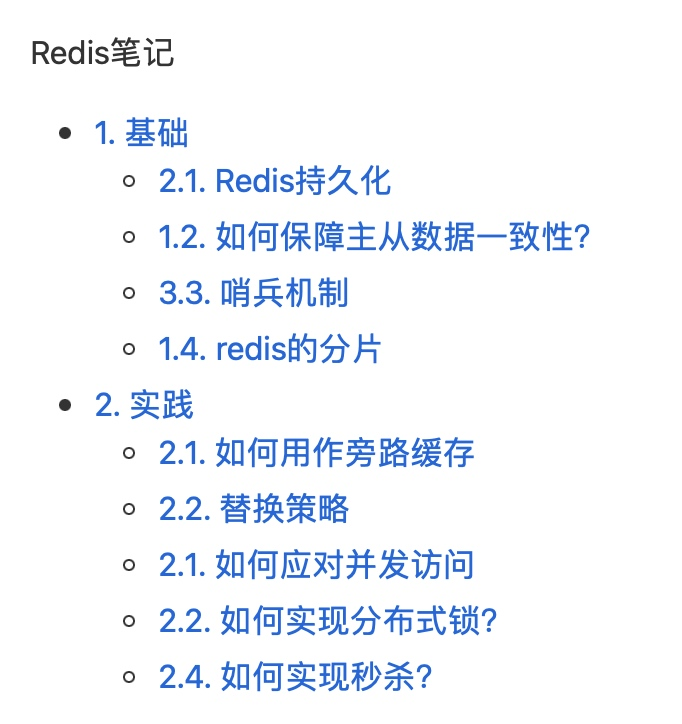
  * 文章1，格式化之后
  * 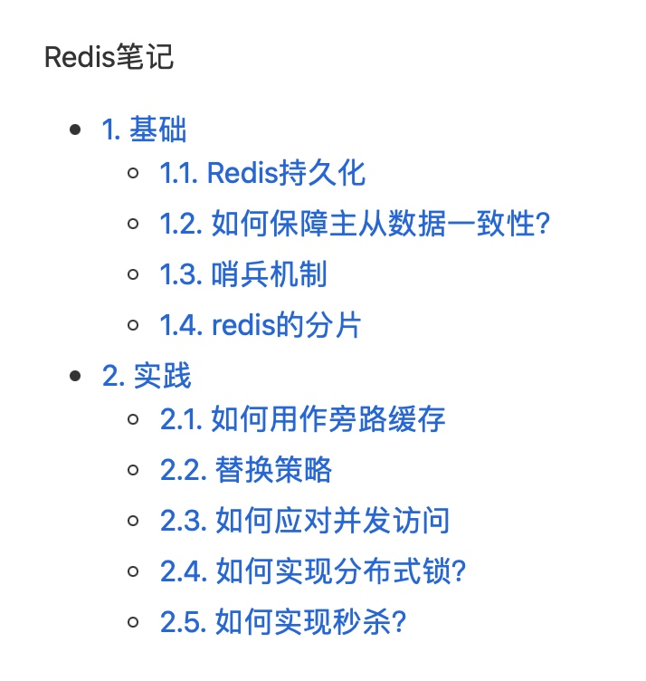
  * 文章2，格式化之前
  * 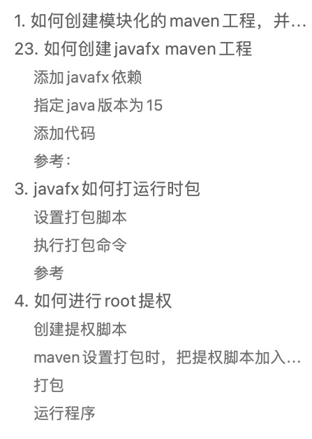
  * 文章2，格式化之后
  * 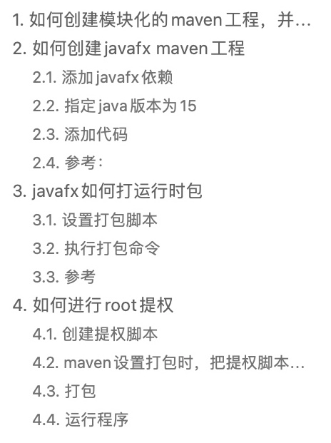

## 4. "mn" 快速创建笔记
* 
* 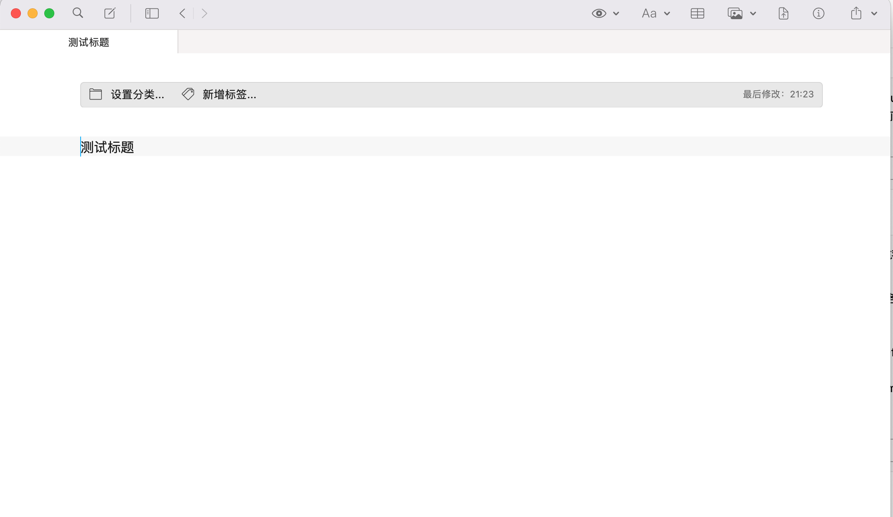

## 5. "mb" 手动git备份
### 5.1. 初始化设置
```shell
cd ~/Library/Containers/com.coderforart.MWeb3/Data/Library/Application\ Support/MWebLibrary
echo 'mainlib.db' >> .gitignore
echo '/docs/media' >> .gitignore
echo '/metadata' >> .gitignore
git init
git checkout -b main
git add .
git commit -m "first commit"
git remote add origin 【你申请的git仓库地址】
git push -u origin main
```
### 5.2. 使用
* 

## 设置环境变量(必须设置)

1.打开MWeb workflow 的环境变量设置页面

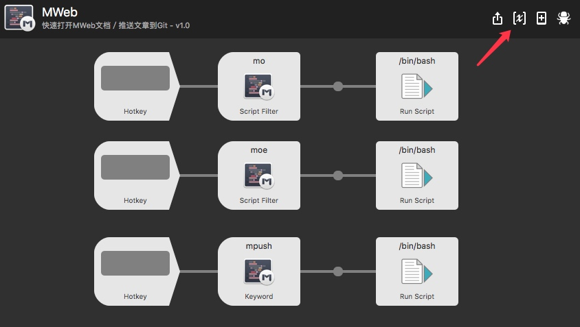

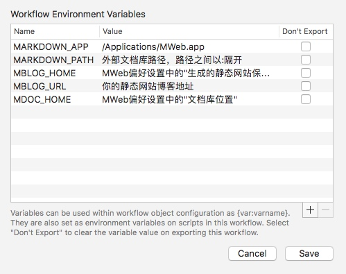

2.打开MWeb偏好设置,复制对应路径到workflow变量中


**MWeb 4内部配置**
* 默认文档位置：
`${HOME}/Library/Containers/com.coderforart.MWeb3/Data/Documents/mainlib/`
* iCloud 文档位置：
`~/Library/Containers/com.coderforart.MWeb3/Data/Library/Application Support/MWebLibrary`
* 静态博客保存位置
`${HOME}/Library/Containers/com.coderforart.MWeb3/Data/Documents/themes/Site/`
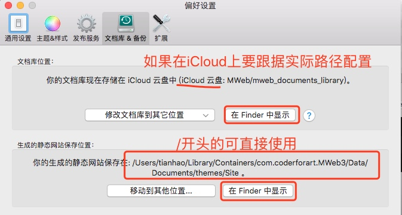

**外部文档配置**
* **MARKDOWN_PATH** 变量，外部文档搜索路径，可以配置多个路径，路径之间以`:`隔开，例如:`${HOME}/working:${HOME}/blog:${HOME}/fun`
* **MARKDOWN_APP** 变量，打开外部文档的App，默认是`/Applications/MWeb.app`,你可以设置为其它App，设置后会用该App打开外部文档。

**静态博客配置(可选)**
* **MBLOG_HOME** 填静态博客生成目录；
* **MBLOG_URL** 填上的你Blog地址(如果使用了MWeb的静态博客功能)；

3.设置快捷键（可选）

workflow 默认没有设置`mo`、`moe`和`mpush`的快捷键，用户可以按照自己的需要设置快捷键
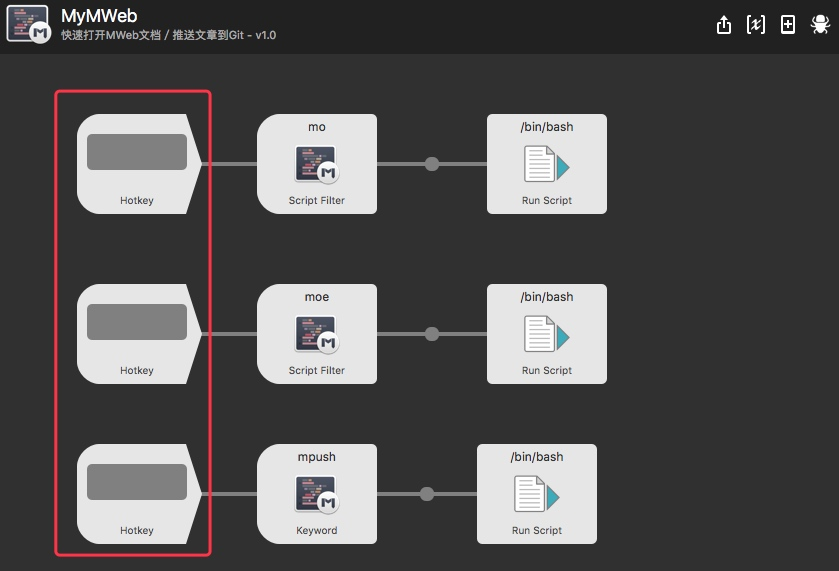
